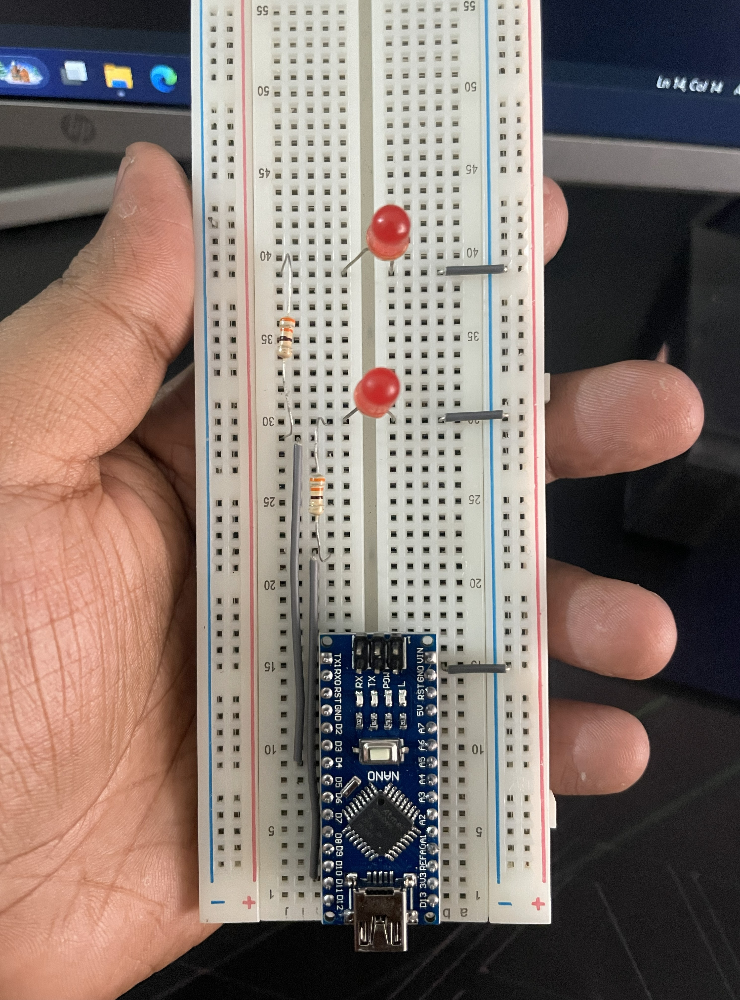

# 🔦 2 LED Lights Blinking Simultaneously 💡💡 (Arduino)

This project shows how to blink **two LEDs at the same time** using an Arduino. Both LEDs turn **ON together** and **OFF together** repeatedly. 🔁

---

## ✨ Features
- ✅ Two LEDs blink **simultaneously**
- ✅ Beginner-friendly Arduino project
- ✅ Easy to modify pins and blinking speed

---

## 🧰 Components Required
- 🟦 Arduino (UNO / Nano / compatible)
- 💡 2× LEDs
- 🟫 2× Resistors (**220Ω** or **330Ω** recommended)
- 🧵 Jumper wires
- 🍞 Breadboard (optional)

---

## 🔌 Circuit / Wiring
Connect each LED like this:

### LED 1
- LED long leg (anode) ➜ Arduino **digital pin** (as set in code)
- LED short leg (cathode) ➜ **GND** (through a resistor)

### LED 2
- LED long leg (anode) ➜ Arduino **digital pin** (as set in code)
- LED short leg (cathode) ➜ **GND** (through a resistor)

> ⚠️ Always use a resistor with each LED to prevent damage.

---

## 🧠 How It Works
The Arduino code runs in a loop:
1. Turn **both LEDs ON**
2. Wait (`delay`)
3. Turn **both LEDs OFF**
4. Wait (`delay`)
5. Repeat forever 🔁

---

## 📁 Project Files
- 📄 `Simultaneously_blinking.ino` — Arduino code
- 🖼️ `IMG_3599.jpg` — circuit/setup image
- 🎥 `IMG_3600.MOV` — demo video

---

## ▶️ How to Run 🚀
1. Install and open **Arduino IDE**
2. Open: `Simultaneously_blinking.ino`
3. Select your board:
   - `Tools -> Board -> Arduino Uno / Arduino Nano`
4. Select your port:
   - `Tools -> Port -> (your COM port)`
5. Click **Upload** ⬆️
6. Watch both LEDs blink together ✨

---

## ⚙️ Customization
### ⏱️ Change Blinking Speed
Change the `delay(...)` value in the code:
- Smaller delay ➜ faster blinking ⚡
- Larger delay ➜ slower blinking 🐢

### 🔌 Change LED Pins
Update the pin numbers in the code and connect the LEDs to the same pins.

---

## 📸 Picture Section

---

## 🎥 Demo Video
▶️ [Watch Demo](IMG_3600.MOV)

---

## 🛠️ Troubleshooting
- ❌ LEDs not blinking?
  - Check LED direction (long leg to pin, short leg to GND)
  - Ensure resistors are connected properly
  - Make sure the selected **Board** and **Port** are correct
  - Confirm pin numbers match your wiring

---

## 📜 License
Free to use for learning and practice ✅
